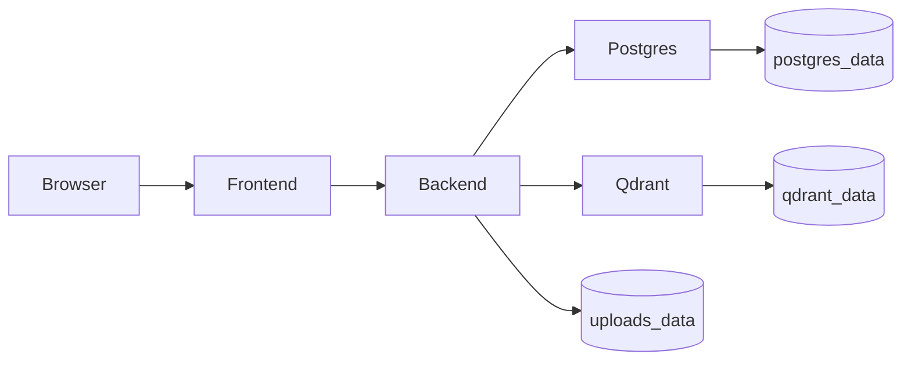

# DocuGuard AI Enterprise Assistant

## Tech Stack

- **Frontend**: Next.js (TypeScript, Tailwind CSS)
- **Backend**: FastAPI (Python)
- **Database**: PostgreSQL (SQLAlchemy + Alembic)
- **Vector DB**: Qdrant
- **Deployment**: Docker Compose

## Prerequisites

- [Docker Desktop](https://www.docker.com/products/docker-desktop/) (or Docker Engine + Docker Compose v2)
- An [OpenAI API key](https://platform.openai.com/api-keys) for embeddings and chat

## Quick Start with Docker

### 1. Configure environment variables

Copy the Docker environment template and edit it:

```bash
cp .env.docker .env
```

Set at minimum:

| Variable | Description |
|----------|-------------|
| `OPENAI_API_KEY` | Your OpenAI API key |
| `SECRET_KEY` | Long random string for JWT signing (change from default) |

Optional overrides: database credentials, ports, and `NEXT_PUBLIC_API_URL` (must match how the browser reaches the backend API).

### 2. Build and start all services

From the project root:

```bash
docker compose up --build -d
```

This starts four services:

| Service | Image / build | Default URL |
|---------|---------------|-------------|
| **frontend** | `./frontend/Dockerfile` | http://localhost:3000 |
| **backend** | `./backend/Dockerfile` | http://localhost:8000 |
| **postgres** | `postgres:15-alpine` | `localhost:5432` |
| **qdrant** | `qdrant/qdrant:v1.12.5` | http://localhost:6333 |

Wait until all containers are healthy:

```bash
docker compose ps
```

### 3. Run database migrations

Apply the schema after Postgres is up:

```bash
docker compose exec backend alembic upgrade head
```

### 4. Seed initial data (optional)

Populate a demo admin user, sample document record, and chat session:

```bash
docker compose exec backend python seed.py
```

Default seeded credentials (from `backend/seed.py`):

- **Email**: `admin@docuguard.com`
- **Password**: `securepassword`

### 5. Use the application

- **Frontend**: http://localhost:3000
- **Backend API**: http://localhost:8000
- **Swagger docs**: http://localhost:8000/docs
- **Qdrant dashboard**: http://localhost:6333/dashboard

## Docker architecture



## Persistent volumes

Data survives container restarts:

| Volume | Mount | Purpose |
|--------|-------|---------|
| `docuguard_postgres_data` | `/var/lib/postgresql/data` | PostgreSQL data |
| `docuguard_qdrant_data` | `/qdrant/storage` | Vector embeddings |
| `docuguard_uploads_data` | `/app/uploads` | Uploaded documents |

List volumes:

```bash
docker volume ls | findstr docuguard
```

Remove all data (destructive):

```bash
docker compose down -v
```

## Health checks

Each service defines a health check in `docker-compose.yml`:

- **postgres**: `pg_isready`
- **qdrant**: HTTP readiness on port 6333
- **backend**: `GET /health`
- **frontend**: HTTP response on port 3000

The backend waits for healthy Postgres and Qdrant; the frontend waits for a healthy backend.

Inspect health:

```bash
docker compose ps
docker inspect --format='{{.State.Health.Status}}' docuguard-ai-backend-1
```

## Environment variables

Template: [`.env.docker`](.env.docker). Docker Compose loads `.env` for substitution and passes it to Postgres and the backend via `env_file`.

| Variable | Used by | Notes |
|----------|---------|-------|
| `POSTGRES_*` | postgres, backend | DB connection |
| `OPENAI_API_KEY` | backend | Required for AI features |
| `SECRET_KEY` | backend | JWT signing |
| `BACKEND_CORS_ORIGINS` | backend | JSON array, e.g. `["http://localhost:3000"]` |
| `QDRANT_URL` | backend | Set in compose to `http://qdrant:6333` (internal) |
| `NEXT_PUBLIC_API_URL` | frontend build | Browser-facing API URL; rebuild frontend after changing |

Rebuild the frontend if you change `NEXT_PUBLIC_API_URL`:

```bash
docker compose build --no-cache frontend
docker compose up -d frontend
```

## Common commands

```bash
# View logs
docker compose logs -f

# Stop services (keep volumes)
docker compose down

# Stop and remove volumes
docker compose down -v

# Run backend shell
docker compose exec backend bash

# Re-run migrations
docker compose exec backend alembic upgrade head

# Re-run seed (idempotent for existing admin user)
docker compose exec backend python seed.py
```

## Local development (without Docker)

See service READMEs under `backend/` and `frontend/` for native setup. For Docker-based development with live backend reload, mount source code in a local override file (not included by default).

## Troubleshooting

| Issue | What to try |
|-------|-------------|
| Backend unhealthy | `docker compose logs backend`; confirm Postgres and Qdrant are healthy |
| Frontend cannot reach API | Ensure `NEXT_PUBLIC_API_URL` matches `http://localhost:8000` and rebuild frontend |
| OpenAI errors | Verify `OPENAI_API_KEY` in `.env` and restart backend: `docker compose up -d backend` |
| Empty database | Run `docker compose exec backend alembic upgrade head` then `python seed.py` |
| Permission errors on uploads | Volume `docuguard_uploads_data` is owned by the container; avoid bind-mount conflicts |
