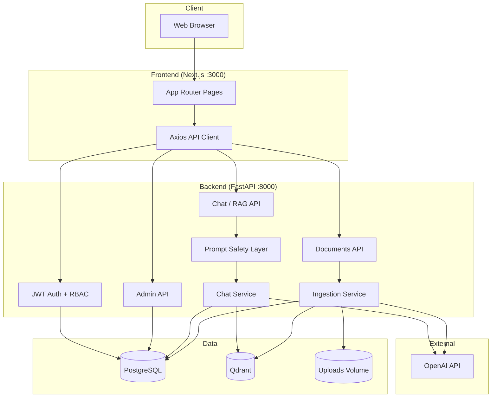
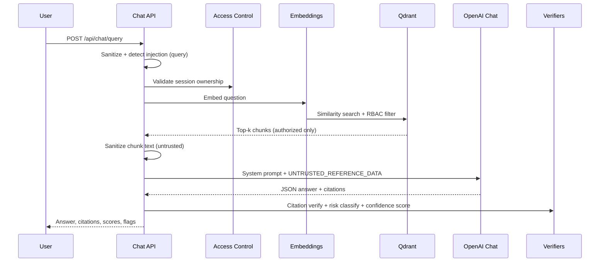

# DocuGuard AI

**Enterprise knowledge assistant with secure RAG, citations, and compliance-aware guardrails.**

DocuGuard AI helps teams query internal policy and legal documents through a grounded chat interface. Answers are retrieved from authorized corpora only, cited to source chunks, scored for confidence, and flagged for human review when risk or injection patterns are detected.

[](https://fastapi.tiangolo.com/)
[](https://nextjs.org/)
[](https://docs.docker.com/compose/)
[]()

> **Portfolio kit:** [PORTFOLIO.md](PORTFOLIO.md) — GitHub description, LinkedIn post, resume bullets, 2-min demo, architecture narrative, challenges solved, interview talking points.

---

## Table of Contents

1. [Project Overview](#1-project-overview)
2. [Problem Statement](#2-problem-statement)
3. [Features](#3-features)
4. [Tech Stack](#4-tech-stack)
5. [Architecture](#5-architecture)
6. [RAG Pipeline](#6-rag-pipeline)
7. [Screenshots](#7-screenshots)
8. [Setup Instructions](#8-setup-instructions)
9. [Environment Variables](#9-environment-variables)
10. [Running with Docker](#10-running-with-docker)
11. [API Documentation](#11-api-documentation)
12. [Evaluation Methodology](#12-evaluation-methodology)
13. [Security Considerations](#13-security-considerations)
14. [Future Improvements](#14-future-improvements)
15. [Resume Bullet Points](#15-resume-bullet-points)
16. [Demo Script](#16-demo-script)

---

## 1. Project Overview

DocuGuard AI is a full-stack **Retrieval-Augmented Generation (RAG)** application built for enterprise document Q&A. Users upload PDF, DOCX, TXT, or Markdown files; the system extracts text, chunks and embeds content into **Qdrant**, and answers questions via **OpenAI** models with strict context-only generation.

The platform adds production-oriented controls that generic chatbots lack: **role-based document access**, **citation verification**, **confidence scoring**, **risk classification**, **prompt-injection defenses**, and an **admin observability dashboard**.

| Layer | Role |
|-------|------|
| **Frontend** | Next.js dashboard, document upload, chat UI with citations and risk badges |
| **Backend** | FastAPI orchestration, ingestion, RAG, auth, admin analytics |
| **PostgreSQL** | Users, documents, chat history, query audit logs |
| **Qdrant** | Vector search with metadata filters for access control |

---

## 2. Problem Statement

Organizations store policies, handbooks, and compliance material across scattered files. Employees waste time searching PDFs, and generic LLMs:

- **Hallucinate** policies not present in source documents  
- **Leak** confidential content across teams  
- **Lack citations** needed for audit and legal defensibility  
- **Ignore access rules** (HR vs. legal vs. general staff)  
- **Remain vulnerable** to prompt injection via user queries or malicious uploads  

DocuGuard AI addresses these gaps with grounded retrieval, enforced authorization, traceable citations, and layered safety checks before and after LLM generation.

---

## 3. Features

### Document intelligence
- Multi-format ingestion (PDF, DOCX, TXT, MD) with magic-byte validation  
- Background indexing pipeline (extract → chunk → embed → Qdrant)  
- Upload status tracking (`uploaded`, `processing`, `indexed`, `failed`)  

### Secure RAG chat
- Semantic search over authorized chunks only  
- JSON-structured answers with document/page citations  
- Citation verifier rewrites unsupported claims  
- Confidence score from retrieval similarity and citation coverage  
- Risk classifier for sensitive topics (termination, legal, financial)  

### Enterprise controls
- JWT authentication and role-based access (`admin`, `hr`, `legal`, `employee`, `user`)  
- Per-user and `public` document visibility  
- Qdrant metadata filtering aligned with PostgreSQL ACL  
- Prompt-injection detection and neutralization (user + document text)  
- Redacted chunk previews in API responses and audit logs  

### Admin & observability
- Query volume, confidence averages, high-risk query feeds  
- Low-confidence and failed-ingestion monitoring  
- Swagger/OpenAPI interactive docs  

### Engineering quality
- **63+** backend pytest cases (auth, RAG, security, prompt injection)  
- Docker Compose stack with health checks and persistent volumes  
- Offline evaluation harness with JSON/CSV reports  

---

## 4. Tech Stack

| Category | Technology |
|----------|------------|
| **Frontend** | Next.js 14, React 18, TypeScript, Tailwind CSS, Axios |
| **Backend** | Python 3.11, FastAPI, Pydantic v2, SQLAlchemy, Alembic |
| **AI / ML** | OpenAI API (`text-embedding-3-small`, `gpt-4o-mini`) |
| **Vector DB** | Qdrant |
| **Database** | PostgreSQL 15 |
| **Auth** | JWT (HS256), bcrypt password hashing |
| **Parsing** | PyMuPDF, python-docx |
| **Deployment** | Docker, Docker Compose |
| **Testing** | pytest, FastAPI TestClient |

---

## 5. Architecture



### Repository layout

```
DocuGuard-AI/
├── backend/                 # FastAPI application
│   ├── app/
│   │   ├── api/routes/      # auth, documents, chat, admin
│   │   ├── core/            # config, security, prompt_safety
│   │   ├── services/        # ingestion, vector_db, chat, risk, citations
│   │   ├── models/          # SQLAlchemy ORM
│   │   └── schemas/         # Pydantic DTOs
│   ├── tests/               # pytest suite
│   ├── alembic/             # DB migrations
│   ├── evaluate.py          # RAG evaluation harness
│   └── seed.py              # Demo data seeder
├── frontend/                # Next.js UI
├── docker-compose.yml
├── .env.docker              # Environment template
├── SECURITY.md              # Security model
└── ARCHITECTURE.md          # Extended design notes
```

---

## 6. RAG Pipeline



### Step-by-step

1. **Query intake** — User question is length-bounded, scanned for injection patterns, and neutralized if suspicious.  
2. **Session ACL** — Chat `session_id` must belong to the authenticated user (checked **before** retrieval or LLM).  
3. **Embedding** — Question is embedded with `text-embedding-3-small`.  
4. **Retrieval** — Qdrant returns top-5 chunks; non-admins only see `public` docs or their own uploads.  
5. **Context assembly** — Chunk text is wrapped as `UNTRUSTED_REFERENCE_DATA` with explicit warnings.  
6. **Generation** — `gpt-4o-mini` returns JSON: answer, citations, confidence reasoning, human-review flag.  
7. **Post-processing** — Citation verifier, risk classifier, and confidence scorer run; results persist to `QueryLog`.  

### Ingestion pipeline (upload → indexed)

```
Upload → magic-byte validation → UUID storage → DB record
      → background: extract pages → chunk → embed batch → Qdrant upsert
      → status: indexed
```

---

## 7. Screenshots

> Add screenshots to `docs/screenshots/` and link them here for your portfolio or demo.

| Screen | Description | Placeholder |
|--------|-------------|-------------|
| Dashboard | Document overview and navigation | `` |
| Documents | Upload and indexing status | `` |
| Chat | RAG answers with citations and risk badges | `` |
| Admin | Query analytics and high-risk log feed | `` |

---

## 8. Setup Instructions

### Prerequisites

- [Docker Desktop](https://www.docker.com/products/docker-desktop/) (or Docker Engine + Compose v2)  
- [OpenAI API key](https://platform.openai.com/api-keys)  
- Git  

### Quick start (Docker — recommended)

```bash
git clone https://github.com/bharatbushan03/DocuGuard-AI.git
cd DocuGuard-AI
cp .env.docker .env
# Edit .env: set OPENAI_API_KEY and SECRET_KEY
docker compose up --build -d
docker compose exec backend alembic upgrade head
docker compose exec backend python seed.py
```

Open http://localhost:3000 and sign in with seeded credentials (see [Demo Script](#16-demo-script)).

### Local development (without Docker)

**Backend**

```bash
cd backend
python -m venv .venv
source .venv/bin/activate   # Windows: .venv\Scripts\activate
pip install -r requirements.txt
# Start PostgreSQL and Qdrant locally; set .env variables
alembic upgrade head
uvicorn app.main:app --reload --port 8000
```

**Frontend**

```bash
cd frontend
npm install
export NEXT_PUBLIC_API_URL=http://localhost:8000
npm run dev
```

**Tests**

```bash
cd backend
pytest tests/ -v
```

---

## 9. Environment Variables

Copy [`.env.docker`](.env.docker) to `.env` at the project root.

| Variable | Required | Description |
|----------|----------|-------------|
| `OPENAI_API_KEY` | Yes | OpenAI API key for embeddings and chat |
| `SECRET_KEY` | Yes | JWT signing secret (32+ chars in production) |
| `POSTGRES_USER` | No | Database user (default: `postgres`) |
| `POSTGRES_PASSWORD` | No | Database password |
| `POSTGRES_DB` | No | Database name (default: `docuguard`) |
| `POSTGRES_PORT` | No | Host port for Postgres (default: `5432`) |
| `QDRANT_PORT` | No | Host port for Qdrant (default: `6333`, localhost-bound) |
| `BACKEND_PORT` | No | API port (default: `8000`) |
| `FRONTEND_PORT` | No | UI port (default: `3000`) |
| `NEXT_PUBLIC_API_URL` | Yes (frontend) | Browser-reachable API URL; rebuild frontend after changes |
| `BACKEND_CORS_ORIGINS` | No | JSON array, e.g. `["http://localhost:3000"]` |
| `APP_ENV` | No | `development` or `production` (enables secret validation) |
| `ALLOW_PUBLIC_REGISTRATION` | No | Set `false` to disable open signup |

Internal Docker overrides (set automatically in `docker-compose.yml`): `POSTGRES_HOST`, `QDRANT_URL`.

---

## 10. Running with Docker

### Start the stack

```bash
docker compose up --build -d
docker compose ps          # wait for "healthy"
```

### Services

| Service | URL | Notes |
|---------|-----|-------|
| Frontend | http://localhost:3000 | Next.js production build |
| Backend API | http://localhost:8000 | REST + `/docs` Swagger |
| Swagger UI | http://localhost:8000/docs | Interactive API explorer |
| Qdrant UI | http://localhost:6333/dashboard | Localhost only |
| PostgreSQL | `127.0.0.1:5432` | Localhost only |

### Persistent volumes

| Volume | Purpose |
|--------|---------|
| `docuguard_postgres_data` | Database files |
| `docuguard_qdrant_data` | Vector index |
| `docuguard_uploads_data` | Uploaded documents |

### Common operations

```bash
docker compose logs -f backend
docker compose exec backend alembic upgrade head
docker compose exec backend python seed.py
docker compose exec backend pytest tests/ -q
docker compose down          # stop, keep data
docker compose down -v       # stop and wipe volumes
```

---

## 11. API Documentation

**Base URL:** `http://localhost:8000`  
**Prefix:** `/api`  
**Auth:** Bearer JWT (`Authorization: Bearer <token>`) except register/login.

Interactive docs: **http://localhost:8000/docs**

### Authentication

| Method | Endpoint | Description |
|--------|----------|-------------|
| `POST` | `/api/auth/register` | Create account (default role: `user`) |
| `POST` | `/api/auth/login` | OAuth2 form login → JWT + role |
| `GET` | `/api/auth/me` | Current user profile |

### Documents

| Method | Endpoint | Auth | Description |
|--------|----------|------|-------------|
| `POST` | `/api/documents/upload` | `admin`, `hr`, `legal`, `employee` | Upload file (multipart) |
| `GET` | `/api/documents/` | Authenticated | List authorized documents |
| `GET` | `/api/documents/{id}` | Authenticated | Document metadata + status |

### Chat (RAG)

| Method | Endpoint | Description |
|--------|----------|-------------|
| `POST` | `/api/chat/query` | Ask a question; returns answer, citations, confidence, risk, injection flags |
| `GET` | `/api/chat/sessions` | List user's chat sessions |

**Example query**

```bash
curl -X POST http://localhost:8000/api/chat/query \
  -H "Authorization: Bearer $TOKEN" \
  -H "Content-Type: application/json" \
  -d '{"question": "What is the remote work policy?"}'
```

**Sample response fields:** `answer`, `citations`, `confidence_score`, `risk_level`, `requires_human_review`, `injection_detected`, `injection_categories`, `retrieved_chunks` (preview only), `session_id`.

### Admin

| Method | Endpoint | Role | Description |
|--------|----------|------|-------------|
| `GET` | `/api/admin/stats` | `admin` | Aggregated metrics |
| `GET` | `/api/admin/query-logs` | `admin` | Recent query audit trail |
| `GET` | `/api/admin/high-risk` | `admin` | High-risk queries |
| `GET` | `/api/admin/low-confidence` | `admin` | Low-confidence queries |

### Health

| Method | Endpoint | Description |
|--------|----------|-------------|
| `GET` | `/health` | Liveness check |

---

## 12. Evaluation Methodology

DocuGuard includes an offline **RAG evaluation harness** to measure grounded answering quality.

**Run evaluation**

```bash
cd backend
python evaluate.py
```

**Dataset:** `backend/evaluation_dataset.json` — curated Q&A pairs with expected answers, source documents, risk levels, and refusal behavior.

**Metrics computed**

| Metric | Description |
|--------|-------------|
| **Pass rate** | Composite pass on citation, risk, refusal, and human-review checks |
| **Answer similarity** | Jaccard similarity vs. expected answer |
| **Citation accuracy** | Expected document appears in citation list |
| **Risk classification accuracy** | Predicted `risk_level` matches label |
| **Refusal accuracy** | Unanswerable questions trigger insufficient-context responses |

**Outputs:** `evaluation_report.json`, `evaluation_report.csv`

Use this harness for regression testing after prompt, retrieval, or model changes.

---

## 13. Security Considerations

DocuGuard implements defense-in-depth for enterprise document AI. Full details: **[SECURITY.md](SECURITY.md)**.

| Area | Summary |
|------|---------|
| **Authentication** | JWT (HS256), bcrypt passwords, role from database on login |
| **Authorization** | RBAC on routes; document ACL in SQL + Qdrant filters |
| **Uploads** | Magic-byte validation, size limits, UUID filenames |
| **Prompt injection** | Pattern detection, sanitization, untrusted context wrapping; safe continuation |
| **Data minimization** | Chunk previews only in API; redacted audit logs |
| **Infrastructure** | Postgres/Qdrant bound to localhost in Docker; secrets via env vars |

**Production checklist:** set `APP_ENV=production`, strong `SECRET_KEY`, rotate keys, disable public registration if needed, add network policies and malware scanning.

---

## 14. Future Improvements

- [ ] API rate limiting and request throttling  
- [ ] ClamAV or cloud malware scanning on upload  
- [ ] JWT refresh tokens and revocation list  
- [ ] MFA for admin accounts  
- [ ] Qdrant API key / mTLS and private networking  
- [ ] Hybrid search (BM25 + dense retrieval)  
- [ ] Document delete with vector cleanup  
- [ ] SSO (OIDC/SAML) integration  
- [ ] CI pipeline with `pip audit`, `npm audit`, and evaluation gates  
---

## Changelog

### [v1.0.1] - 2026-05-30
- Initial commit spree experiment.
- Added dummy constants and components for testing.

See **[PORTFOLIO.md §3](PORTFOLIO.md#3-resume-bullet-points-5)** for five polished, ATS-ready bullets.

---

## 16. Demo Script

See **[PORTFOLIO.md §4](PORTFOLIO.md#4-two-minute-demo-script)** for a 2-minute recording script, or §16 in the portfolio kit for an extended 5-minute walkthrough.

---

## License & Contributing

This project is intended for portfolio and educational demonstration. For production use, review [SECURITY.md](SECURITY.md), harden secrets management, and complete the future improvements above.

**Author repository:** https://github.com/bharatbushan03/DocuGuard-AI

---

## Related Documentation

- [PORTFOLIO.md](PORTFOLIO.md) — LinkedIn post, interview prep, challenges solved, GitHub About text  
- [SECURITY.md](SECURITY.md) — Threat model and security controls  
- [ARCHITECTURE.md](ARCHITECTURE.md) — Extended architecture and milestone plan  
- [.env.docker](.env.docker) — Environment variable template  
- [docs/GITHUB_ABOUT.txt](docs/GITHUB_ABOUT.txt) — One-line repo description for GitHub Settings  
# Maintenance commit 1
